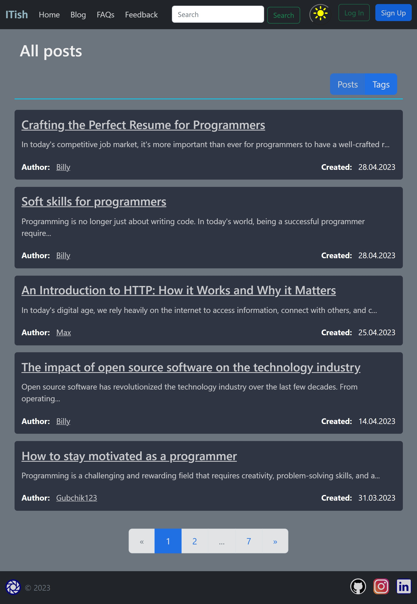

_Blog site to publish posts on the IT topic_

### Demo

Click **<a href="https://itish.site" target="_blank">here</a>** to open ITish blog site

### Project modules (requirements.txt)gevent

        

---

### Site structure

The system consists of the following main functional blocks:

-   Registration, authentication and authorization;
-   Guest functionality;
-   User functionality;
-   Admin functionality.

#### Flask Blueprints

-   Auth (for working with registration, authentication and authorization);
-   Blog (for working with posts and others that are connected with them);
-   Profile (for working with user profiles and pages that are connected with them).

#### Technology stack

-   Backend:
    -   Python programming language;
    -   Flask framework with following extensions:
        -   Flask-Admin (for admin panel);
        -   Flask-Login (for 'auth' functionality);
        -   Flask-Migrate (for migrations);
        -   Flask-SQLAlchemy (for database using python objects);
        -   Flask-WTF (for rendering forms).
    -   MySQL / PostgreSQL database;
-   Frontend:
    -   HTML & CSS;
    -   JavaScript;
    -   Bootstrap 5.

            
### License

[ITish](https://github.com/Gubchik123/ITish) is licensed under the [MIT License](https://github.com/Gubchik123/ITish/blob/master/LICENSE.md).